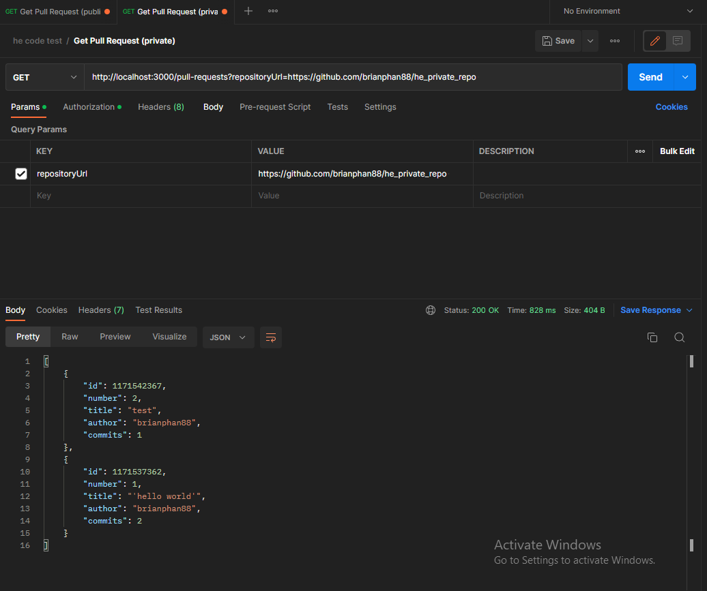

# HE_code_test

## Intro
i took a minimalist approach without leveraging too many libraries or frameworks to complete this project. my reasoning for this is to demonstrate my baseline understanding of node, express, js/ts, and the lightweight implementation could be understood by all levels of reviewers. the libs and frameworks i did choose to use are generally recognized by the javascript community. i would have chosen nestjs if i were looking for something more robust and opinionated. i hope you enjoy reviewing my code

## Todos
  * Swagger/OpenAPI documentation
  * add helpful logging and error message for observability
  * implement stronger lint/style guide
  * implement a validation library
  * implement a http status code library
  * add launch.json for jest testing
  * optimize tsconfig for deployment
  * add testing for the auth flow

## How to run
 * install dependencies by running the command: `npm install`
 * run the app using the command `npm start`
 * run the app in debug mode by using the `launch.json` provided
 * you can run test by running the command `npm run test`

## How to use the api
  * Postman
  